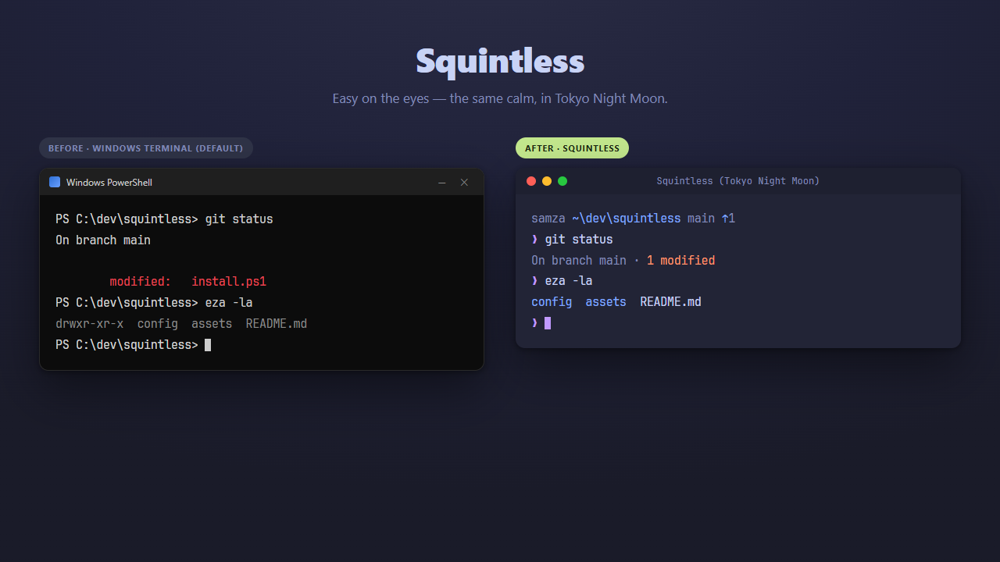

<div align="center">

# Squintless

### Easy on the eyes.

A one-command, eye-strain–optimized terminal + Claude Code setup for **Windows, macOS & Linux**.
Pick your palette — soft **Gruvbox light** (default) or deep **Tokyo Night Moon** (dark) — done *cohesively*: terminal, font, shell, git diffs and your Claude Code statusline all speak the same calm palette.

[](LICENSE)
[](https://github.com/sameer-zahir/squintless/stargazers)
[](https://github.com/sameer-zahir/squintless/pulls)


</div>

## Install

It asks **light or dark** (or pass a flag), then sets everything up. The installer is **idempotent** and **non-destructive** — it backs up every file it touches (`*.squintless-*.bak`), only wires up tools you actually have, and you can re-run or uninstall any time. Restart your terminal when it's done.

### Windows · [PowerShell 7+](https://aka.ms/powershell)

```powershell
irm https://raw.githubusercontent.com/sameer-zahir/squintless/main/install.ps1 | iex
```

Choose up front and add the full treatment (font/render defaults + the matching Claude Code theme):

```powershell
$s = irm https://raw.githubusercontent.com/sameer-zahir/squintless/main/install.ps1
& ([scriptblock]::Create($s)) -Dark -WithTerminalDefaults -WithClaude
```

*(Not on PowerShell 7? `winget install Microsoft.PowerShell`, open `pwsh`, paste again. Piping `irm | iex` non-interactively defaults to light.)*

### macOS · Linux

```bash
curl -fsSL https://raw.githubusercontent.com/sameer-zahir/squintless/main/install.sh | bash
```

Choose up front and add Claude Code:

```bash
curl -fsSL https://raw.githubusercontent.com/sameer-zahir/squintless/main/install.sh | bash -s -- --dark --with-claude
```

It installs the tools with your package manager (Homebrew / apt / dnf / pacman), themes the terminals it detects (**kitty** & **Ghostty** automatically; **WezTerm**, **Alacritty** & **iTerm2** get the scheme + a one-line instruction), and wires up your shell (`zsh`/`bash`). Other flags: `--terminal=kitty,wezterm`, `--skip-deps`, `--uninstall`, `--yes`.

**Prefer to read it first?** Clone the repo and run `.\install.ps1` (or `./install.sh`) locally — every config it places lives in [`config/`](config/), and it writes a `*.squintless-*.bak` next to anything it changes. Nothing is hidden.

> ⭐ If Squintless saves your eyes, a star genuinely helps it reach the next person squinting at their screen.

## What you get

| Layer | What Squintless sets up |
| --- | --- |
| **Terminal** | A `Squintless (Gruvbox Light)` **or** `Squintless (Tokyo Night Moon)` color scheme — soft `#F2E5BC` or deep `#222436`, no harsh white. Windows Terminal on Windows; kitty / WezTerm / Alacritty / Ghostty / iTerm2 on macOS & Linux |
| **Font** | JetBrains Mono Nerd Font, installed from the official Nerd Fonts release |
| **Shell** | A themed oh-my-posh prompt in your palette — PowerShell on Windows, `zsh`/`bash` on macOS & Linux — plus `zoxide` / `eza` / `bat` / `lazygit` wired in (and PSReadLine syntax colors on PowerShell) |
| **Git** | `git-delta` with a matching syntax theme (`gruvbox-light` / `TwoDark`) — readable diffs that match everything else |
| **Claude Code** *(optional)* | `theme` matched to your variant + a curated [ccstatusline](https://github.com/sirmalloc/ccstatusline) statusline |

Everything is plain config you can read in [`config/`](config/) — nothing hidden.

## Light or dark

Two cohesive palettes, same treatment end-to-end. The installer asks which you want, or pass `-Light` / `-Dark`:

<div align="center">



</div>

| Variant | Scheme | Background | Built for |
| --- | --- | --- | --- |
| **Light** *(default)* | `Squintless (Gruvbox Light)` | `#F2E5BC` | bright rooms, long daytime sessions |
| **Dark** | `Squintless (Tokyo Night Moon)` | `#222436` | low light, late-night sessions |

Each variant carries its own scheme, oh-my-posh prompt, PSReadLine syntax colors, `git-delta` theme and font/render defaults — the `.dark.*` files in [`config/`](config/) mirror the light ones, recolored.

## Why

I built this because my eyes hurt. I spend most of my day in a terminal, so I asked Claude to help me rebuild mine to be genuinely easy on the eyes — then realised the setup was worth sharing with anyone who codes long days. **[The full story →](https://sameerzahir.com/thoughts/an-afternoon-not-a-degree/)**

Most terminal setups are dark, high-contrast, and built to look striking in a screenshot. That's great until you're eight hours into a session in a bright room and your eyes are done.

Light themes exist, but they're usually **just a color scheme** — the prompt, the diffs, the `ls` output and the statusline are all still a mismatched mess. Squintless is the opposite: a **single, coherent, low-strain palette across the whole terminal**, with the font and rendering tuned to match. It's the setup I actually use all day, packaged so you can have it in one command.

- **Soft, not bright** — a warm `#F2E5BC` background instead of glaring white.
- **Cohesive** — terminal, prompt, syntax, git diffs and Claude Code all in one palette.
- **Legible** — JetBrains Mono Nerd Font with grayscale antialiasing (crisp on modern/OLED panels).
- **Honest config** — every value is in `config/`, copy what you like.

## The research — why these exact colors

Squintless isn't a vibe — the palette traces to how eyes actually read a screen. Every contrast number below is **computed from the palette** by [`tools/gen.py`](tools/gen.py) (full table: [`config/generated/wcag-contrast.md`](config/generated/wcag-contrast.md)); the physiological notes are rationale, with the [full write-up here](https://sameerzahir.com/thoughts/an-afternoon-not-a-degree/).

- **No glaring white, no pure black.** Light is a warm `#F2E5BC` (≈78% of pure white's luminance — softer in a bright room); dark is `#222436`, *not* `#000000`. Bright text on true black causes halation/ghosting that's worse for the substantial share of people with astigmatism, so the dark background keeps some luminance.
- **Body text clears WCAG AAA.** Foreground-on-background contrast is **9.2:1** (light) and **10.3:1** (dark) — past the 7:1 AAA bar for normal text. Accent colors (git status, syntax) sit in the 3–7:1 range by design: legible as accents on a calm background, not body copy.
- **Weight that survives rendering.** The font is set to **Medium**, which holds up better than Regular under ClearType / grayscale subpixel rendering on HiDPI panels — thin strokes are where "blurry on Windows" usually comes from.
- **Light leans default.** Dark text on a light background (positive polarity) tends to be read a touch faster for typical vision — so light is the default, with dark a first-class choice for low-light rooms.

No unsourced clinical claims here: the numbers regenerate from the palette, and the "why" links to the longer story.

## Tuning for your display

The **light** variant's `-WithTerminalDefaults` are tuned for a **HiDPI / OLED laptop** (≈215 PPI, 200% scaling); the **dark** variant ships ClearType at size `15` for a standard LCD. Adjust either in Windows Terminal (Settings → your profile → Appearance, or `profiles.defaults`):

| Setting | Squintless default (OLED/HiDPI) | Standard LCD |
| --- | --- | --- |
| `antialiasingMode` | `grayscale` *(avoids color fringing on OLED subpixels)* | `cleartype` |
| `font.cellHeight` | `1.35` | `1.0`–`1.15` |
| `font.size` | `14` | `11`–`12` |

*(macOS/Linux: `install.sh` themes colors only — set your terminal's font to a JetBrains Mono Nerd Font at a comfortable size yourself.)*

## What the installer does (and how to undo it)

1. Installs the tools (oh-my-posh, delta, zoxide, eza, bat, lazygit) + the JetBrains Mono Nerd Font — via `winget` on Windows, Homebrew/apt/dnf/pacman on macOS & Linux.
2. Adds your chosen scheme to your terminal — a non-destructive **fragment** + active scheme on Windows; a kitty/Ghostty `include` (or a dropped scheme + one-line instruction for WezTerm/Alacritty/iTerm2) on macOS & Linux.
3. Copies the oh-my-posh theme to `~/.config/ohmyposh/`.
4. Adds a marker-delimited block to your shell startup file — PowerShell `$PROFILE`, or `~/.zshrc` / `~/.bash_profile` / `~/.bashrc` — that loads the prompt + tool init.
5. Configures `git-delta` in `~/.gitconfig`.
6. *(optional, `-WithClaude` / `--with-claude`)* installs ccstatusline and sets the Claude Code `theme` (matching your variant) + statusline.

**Uninstall** — `-Uninstall` (Windows) or `--uninstall` (macOS/Linux):

```powershell
$s = irm https://raw.githubusercontent.com/sameer-zahir/squintless/main/install.ps1
& ([scriptblock]::Create($s)) -Uninstall
```
```bash
curl -fsSL https://raw.githubusercontent.com/sameer-zahir/squintless/main/install.sh | bash -s -- --uninstall
```

It removes the shell block, the color scheme, the `git-delta` config and the oh-my-posh theme — backing up each file first and leaving installed tools in place. Prefer to do it by hand? Delete the `# >>> squintless >>> … # <<< squintless <<<` block, or restore any `*.squintless-*.bak` backup. Nothing installs a service or runs in the background.

## Prefer to cherry-pick?

Clone it and take only the pieces you want — every file in [`config/`](config/) is standalone:

```powershell
git clone https://github.com/sameer-zahir/squintless.git
cd squintless
.\install.ps1 -WithTerminalDefaults -WithClaude   # Windows — or copy individual config files by hand
```
```bash
./install.sh --with-claude                         # macOS / Linux
```

## Use it inside Claude Code

Squintless is also a tiny **Claude Code plugin**. Add the marketplace, install it, then run `/squintless-setup` — Claude walks you through it for your OS: the full terminal install on Windows / macOS / Linux, or just the Claude Code `theme` + statusline anywhere.

```
/plugin marketplace add sameer-zahir/squintless
/plugin install squintless@squintless
```

## Credits

Made by **[Sameer Zahir](https://sameerzahir.com)** · [@sameer-zahir](https://github.com/sameer-zahir)

Built on the shoulders of [Gruvbox](https://github.com/morhetz/gruvbox), [JetBrains Mono](https://www.jetbrains.com/lp/mono/), [Nerd Fonts](https://github.com/ryanoasis/nerd-fonts), [oh-my-posh](https://ohmyposh.dev), [git-delta](https://github.com/dandavison/delta) and [ccstatusline](https://github.com/sirmalloc/ccstatusline). The color scheme is also available for other terminals via [iTerm2-Color-Schemes](https://github.com/mbadolato/iTerm2-Color-Schemes).

Contributions welcome — more terminals, more package managers, and a Homebrew tap are all fair game. Open an issue or PR.

<div align="center">

**[⭐ Star Squintless](https://github.com/sameer-zahir/squintless)** if it helped your eyes.

MIT © 2026 Sameer Zahir

</div>
